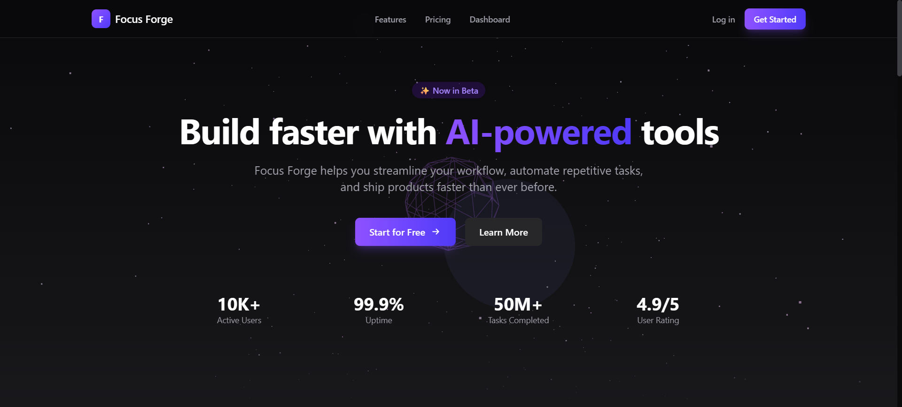
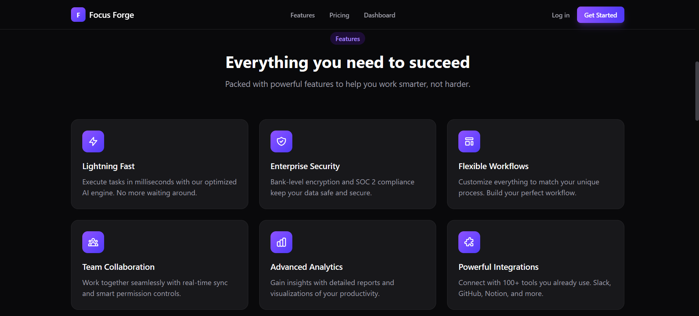
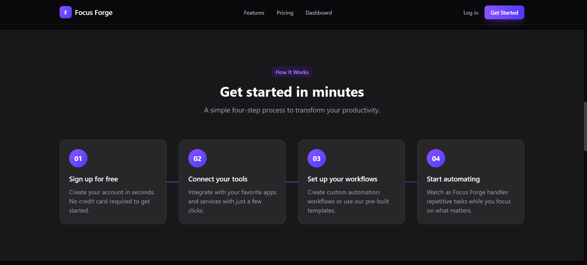
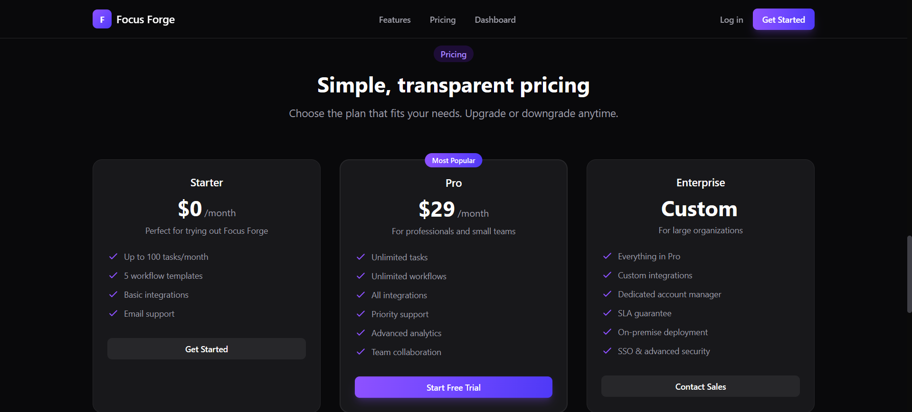
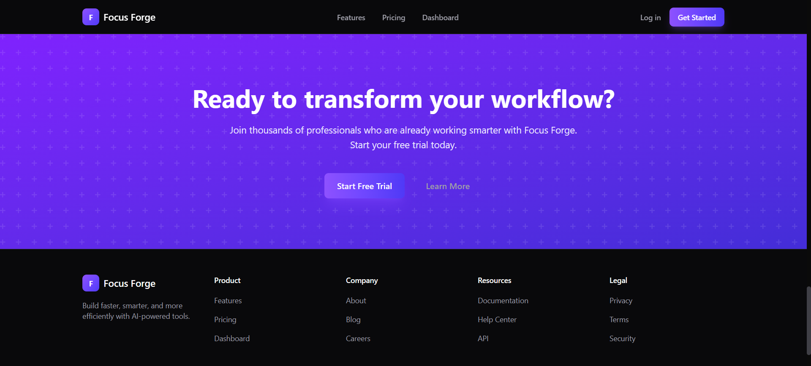

# Prompt-a-thon

A Next.js 16 demo MVP for AI-assisted task and workflow management with Supabase-backed auth and data.

## UI/UX Showcase

This project demonstrates:

- Responsive dashboard and marketing layouts.
- Clear visual hierarchy with reusable UI components.
- Consistent spacing, typography, and component structure.
- Smooth user flows across authentication and product pages.
- MVP-first product thinking with a focused, demo-ready scope.

### Screenshots

| Landing                                                        | Features                                                        |
| -------------------------------------------------------------- | --------------------------------------------------------------- |
|  |  |

| How It Works                                                        | Pricing                                                        |
| ------------------------------------------------------------------- | -------------------------------------------------------------- |
|  |  |



## Prerequisites

- Node.js 20+
- npm or bun

## Environment Variables

Create a `.env.local` file with:

```bash
NEXT_PUBLIC_SUPABASE_URL=
NEXT_PUBLIC_SUPABASE_ANON_KEY=
NEXT_PUBLIC_APP_URL=http://localhost:3000
AI_API_KEY=
AI_MODEL=gpt-4o-mini
```

## Getting Started

Install dependencies:

```bash
npm install
```

Run the development server:

```bash
npm run dev
```

Open [http://localhost:3000](http://localhost:3000).

## Scripts

- `npm run dev`: runs setup and starts Next.js dev server.
- `npm run build`: runs setup and builds production assets.
- `npm run start`: starts production server.
- `npm run lint`: runs ESLint.

## Data Files

The setup script ensures `public/data/tasks.json` exists. A template is available at `public/data/tasks.json.template`.

## Repository Note

Git tracking was initialized on 2026-03-01 after local development. See `DEVLOG.md` for milestone notes.
